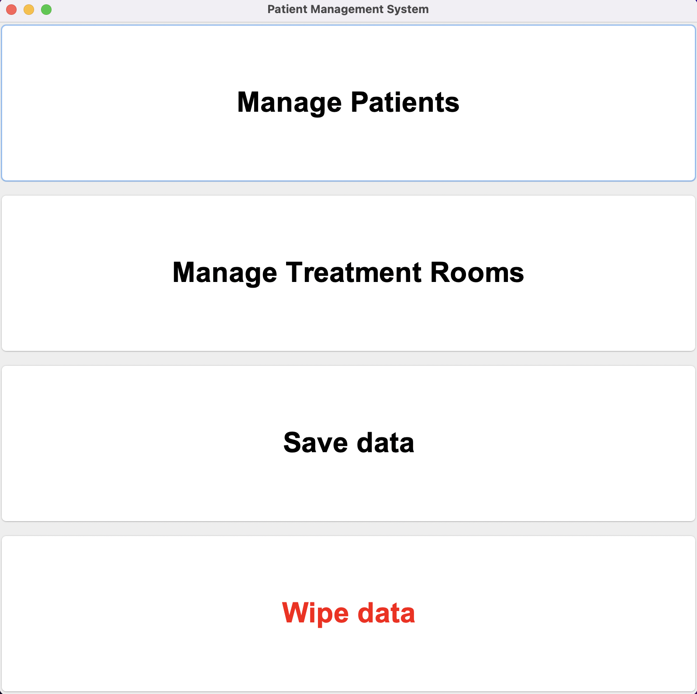
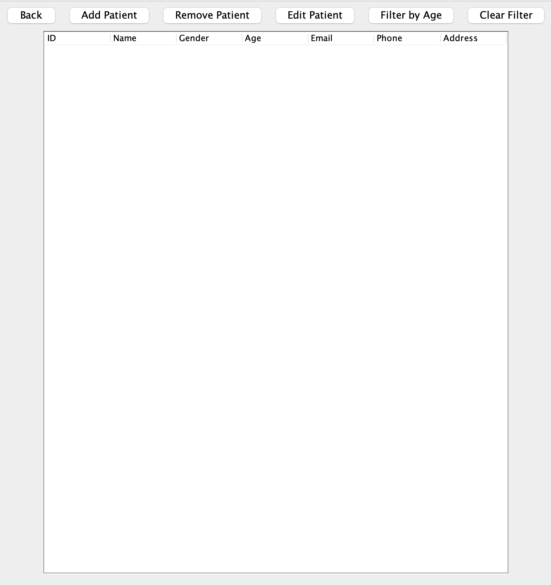
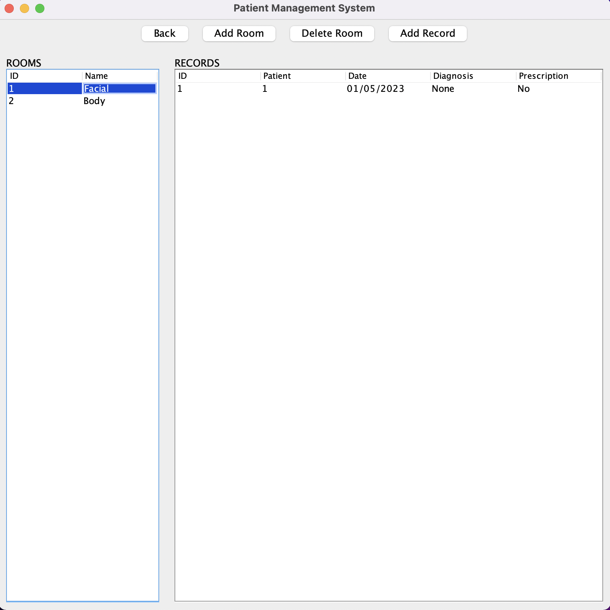
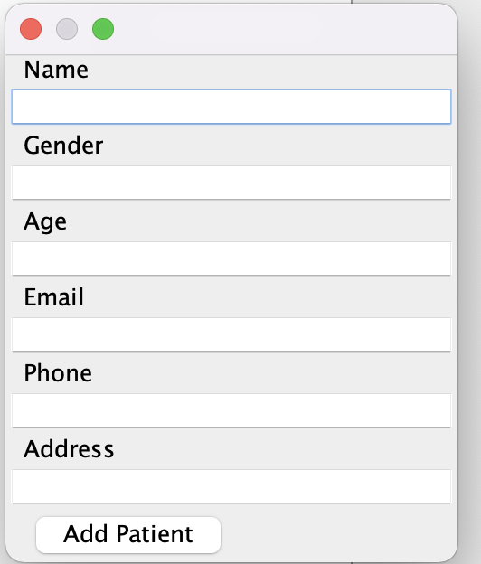
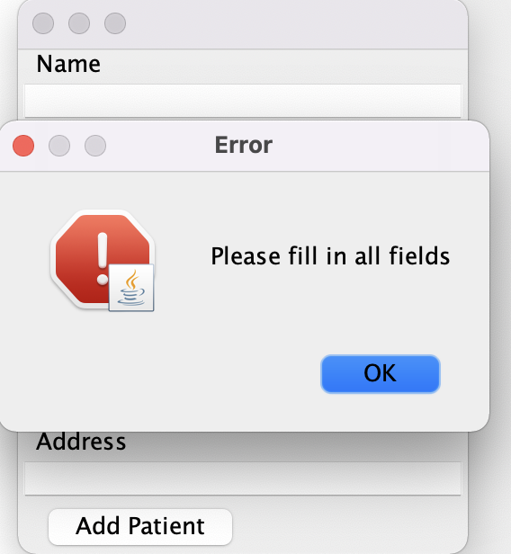

# Hướng dẫn chạy

WindowsOS

```
.\run
```

Linux/ MacOS

```
bash run.bat
```

# Mô tả

Phần mềm quản lý bệnh viện, với các lớp chính:

* Bệnh nhân.
* Bệnh án.
* Phòng điều trị

Trong đó, bệnh nhân mô tả một bệnh nhân do bệnh viện quản lý. Phòng điều trị mô tả một phòng điều trị do bệnh viện quản lý. Và bệnh án mô tả một hồ sơ bệnh án của bệnh nhân tại phòng điều trị.

Dữ liệu sau các phiên sử dụng được lưu tại 2 file: [patients.bin](./data/patients.bin) và [rooms.bin](./data/rooms.bin) dưới dạng file nhị phân.

Giao diện được thiết kế sử dụng thư viện Javaswing của Java và xây dựng theo kiến trúc Model - View - Control.

# Minh hoạ

Khi mở chương trình


Khi quản lý bệnh nhân


Khi quản lý phòng điều trị


Một form để người dùng thao tác với chương trình


Khi gặp input sai


